```{r load_packages, message=FALSE, warning=FALSE, include=FALSE} 
library(fontawesome)
```

class: center title-slide

<br><br><br><br><br><br>

`r fa("eye", fill = "darkblue", height = "4em")`
# **Les images**
## Prenons un peu de recul

<br><br>

#### École thématique TRANSCARTO, Aussois

<br><br>

.left[Laurent Jégou - jegou@univ-tlse2.fr]
.left[UT2J / UMR LISST-Cieu, 21 oct 2021]
.logo1[
</img>
]
.logo2[
</img>
]

---
class: middle

# Programme

--

1. Le contexte, le **fonctionnement** de la carte comme image

--

2. La **lisibilité** de l'image, comment l'améliorer ?

--

3. Le **support web**¨ : animation, interaction

--

4. Application sur des images de l'école **TransCarto**

---
# 1. Le contexte

Pour prendre du recul, il faut s'interroger sur *l'acte de cartographier*, ses auteurs et leurs objectifs.

--

Pendant longtemps, la production de cartes a été comprise, sous-entendue, selon un contexte de communication (théorie de l'information).

---
#Le paradigme de la communication


> "Processus de l’information cartographique", A.A. Moles, 1964.

--

L'**auteur** concevait le document, en demandait la production par un.e **cartographe**, en lui fournissant des données.

Le document était ensuite **édité sur papier**, puis **diffusé**.

La carte diffusée était potentiellement **reçue** par un **lecteur** ou une **lectrice** (relativement passif.ve).

---
class: middle

**Ce paradigme impliquait que :**

--

- La carte était faite une fois pour toutes

>**&#8594;** C'est un document figé, dont on ne maîtrise pas l'utilisation qui en est faite.

--

- Elle devait être rapidement lisible, donc utiliser des formes simples

>**&#8594;** L'enjeu est donc du côté du langage graphique, à maîtriser par le cartographe et à apprendre du côté des lecteurs.

--

- Elle était fournie comme image isolée, avec parfois un bloc de texte descriptif

>**&#8594;** Elle devait se comprendre toute seule, sans accompagnement discursif.

---

#Un paradigme remis en cause

Cette façon de concevoir la production de carte est souvent sous-entendue, elle constitue un *paradigme*, qui est logiquement remis en cause par les évolutions des *pratiques* et des *techniques*.

Elle présente la cartographie selon un angle *positiviste*, voire scientiste, ce qui évacue toute une série d'autres fonctionnements de la carte...

---

- la carte **outil de pouvoir**, performative, de propagande, menteuse (vision *post-moderniste*, B. Harley)

.center[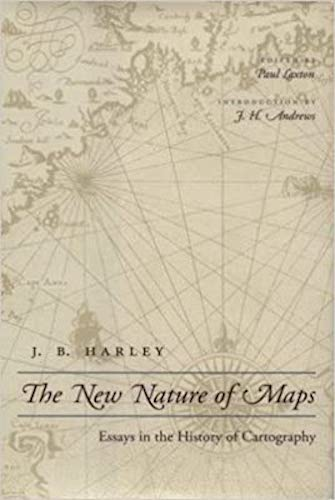]
> Brian J. Harley, The New Nature of Maps, 2001

---

- la carte comme **outil d'analyse**, moyen de découvrir des phénomènes et des relations, dans un *processus d'exploration* (paradigme *analytique*, W. Tobler, K. Clarke, vers la géomatique et les SIG)

.center[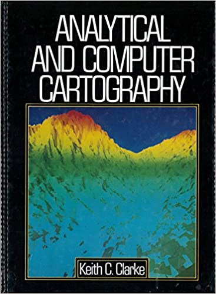]
> K. Clarke, Analytical and Computer Cartography, 1990.
---

- la carte comme **outil d'organisation d'une communauté** sur son territoire (paradigme *participatif*, M. Noucher, Th. Joliveau)

.center[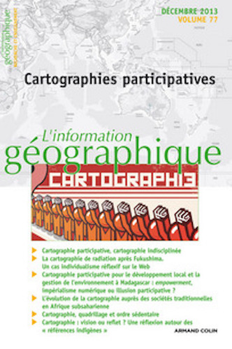]
> N° spécial de l'Information Géographique n°774, 2013

---

- la carte comme **outil de visualisation de *son* propre territoire**, adaptée, mise à jour et centrée sur sa position (paradigme de *l'égo-cartographie*).

.center[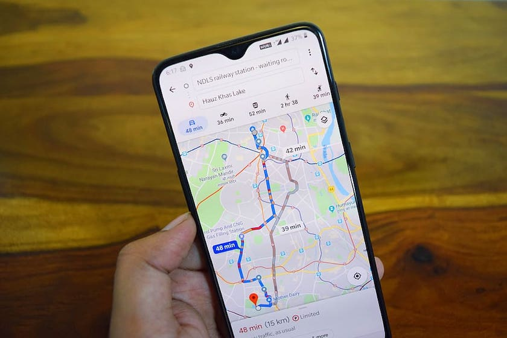]

---

- la carte *décorative* a valeur esthétique, historique, émotive...

.center[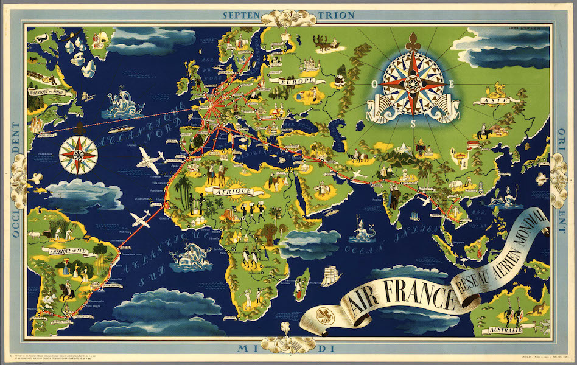]
>L. Boucher, affiche publicitaire Air France, 1937

---

- la carte *imaginaire* ou *poétique*, aussi à valeur esthétique.

.center[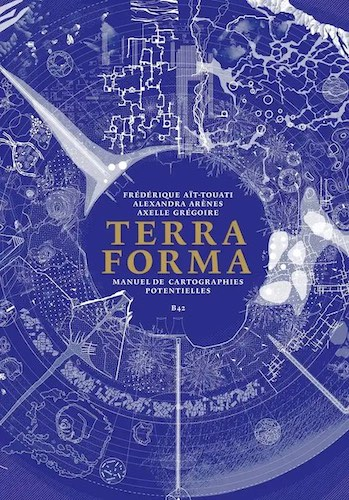]
> Terra Forma, F. Aït-Touati, A. Arènes, A. Grégoire, éditions B42, 2019.

---
class: middle

#Prendre du recul

Ces réflexions permettent se poser des questions de contexte, pour mieux comprendre les questions de lisibilité :

--

- Quel *rôle* j'endosse quand je produit une carte ?

--

- À quoi doit *servir* ma carte ?

--

- À quel *public* est-elle destinée ?

--

- Comment *fonctionne* ma carte ?

---
class: middle

**&#8594;** Selon ces différents positionnements, la carte va devoir s'adapter pour être **efficace**, au sens de J. Bertin (communication), ou, plus généralement du design, c'est à dire *accomplir sa fonction*.

**&#8594;** Il faut donc s'interroger sur sa **lisibilité**, sa réception dans le cadre du fonctionnement prévu.

---
class: middle

#Différents types de cartes et de contextes de fonctionnement

<p style="float: left;">`r fa("file-image", fill = "darkblue", height = "2em")` </p><p style="margin-left: 140px; padding-top: 20px"> L'image fixe qui doit *communiquer* efficacement des informations spatialisées à un public large.</p>

<p style="float: left;">`r fa("file-image", fill = "darkblue", height = "2em")` `r fa("recycle", fill = "darkblue", height = "2em")` `r fa("file-image", fill = "darkblue", height = "2em")`</p><p style="margin-left: 140px; padding-top: 20px"> L'image fixe (mais facilement modifiable) qui doit *me* permettre de comprendre des aspects spatiaux de l'information que je suis en train d'analyser, dans le cadre d'un *processus analytique*.</p>

<p style="float: left;">`r fa("file-video", fill = "darkblue", height = "2em")`</p><p style="margin-left: 140px; padding-top: 20px"> L'image *animée*, qui doit communiquer un *processus* spatial évolutif, progressif.</p>

<p style="float: left;">`r fa("tablet-alt", fill = "darkblue", height = "2em")`</p><p style="margin-left: 140px; padding-top: 20px"> L'image *interactive*, qui doit permettre d'*explorer* des composantes spatiales d'une information.</p>

---
class: middle

#Différents besoins de lisibilité des images cartographiques, selon leur fonctionnement

--

- **Quelle adaptation de l'image à la *perception visuelle* humaine ?**

> **&#8594;** Fonctionnement de la perception visuelle des images

--

- **Quelle adaptation de l'image à une bonne expression de son contenu pour sa fonction ?**

> **&#8594;** Conception et *design graphique*

--

- **Quelle *expérience du public* face à ce type d'image ?**

> **&#8594;** État de l'art et études de *réception*

--

- **Quel *accompagnement* du public pour sa compréhension ?**

> **&#8594;** Les lectures comme processus : animation, *storytelling*, interactivité.

---
#Notions de perception visuelle des images graphiques

**&#8594;** Principes de base de la perception visuelle

**&#8594;** Conséquences pour la composition d'images cartographiques

---
# La perception visuelle n'est pas automatique, immédiate et parfaite
(Contrairement à ce que notre cerveau tend à nous faire croire !)

**&#8594;** Quelques illusions d'optique.

---
class: middle

.center[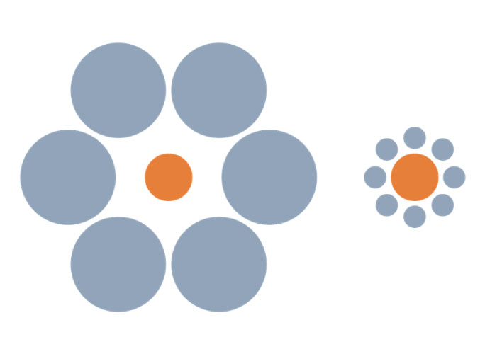]
> Illusion de Mond-Vergleich

---
class: middle

.center[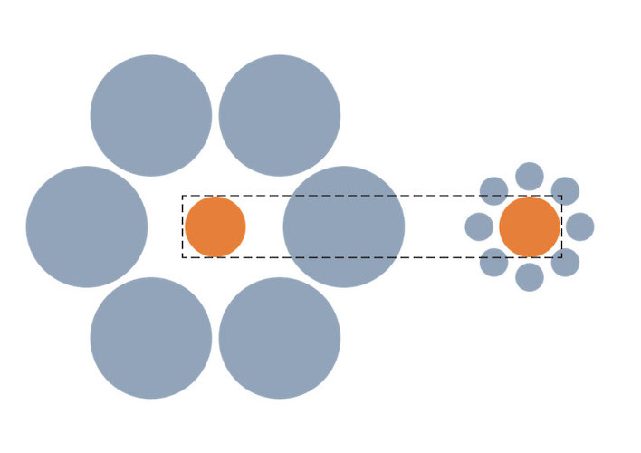]
> Illusion de Mond-Vergleich

---
class: middle

.center[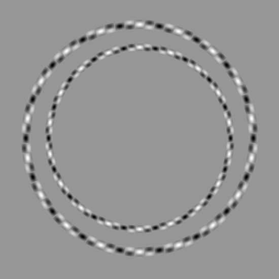]
> Spirale ou cercles ?

---
class: middle

.center[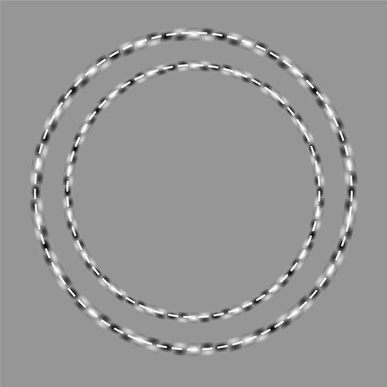]
> Spirale ou cercles ? : la solution

---
#Preception visuelle : plusieurs niveaux d'attention
**1. La perception pré-attentive**

> [Ch. G. Healey, "Perception in Visualization"](https://www.csc2.ncsu.edu/faculty/healey/PP/).

---

.center[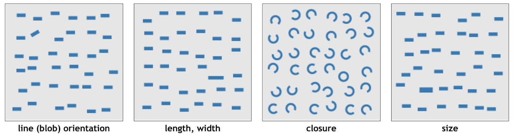]
.center[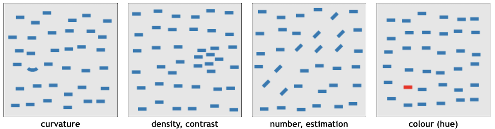]
.center[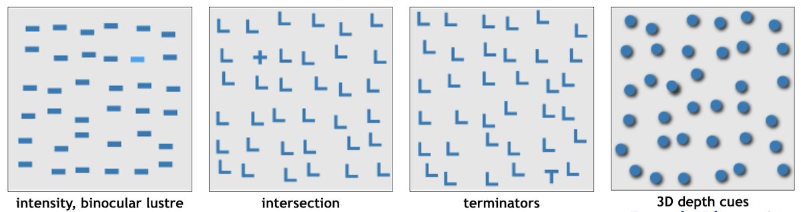]

---
**&#8594;** Des compléments apportés par C. Ware
.center[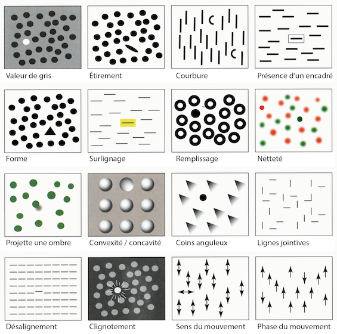]
> "C. Ware, InfoViz, perception for design", 2008.

---
### Certaines variations visuelles sont plus efficaces que d'autres
Car repérées par des neurones spécialisés, plus rapides, mais il faut aussi tenir compte de la perturbation.

La variation de couleur seule (a) est plus lisible qu'un mélange couleur + forme (b).

.center[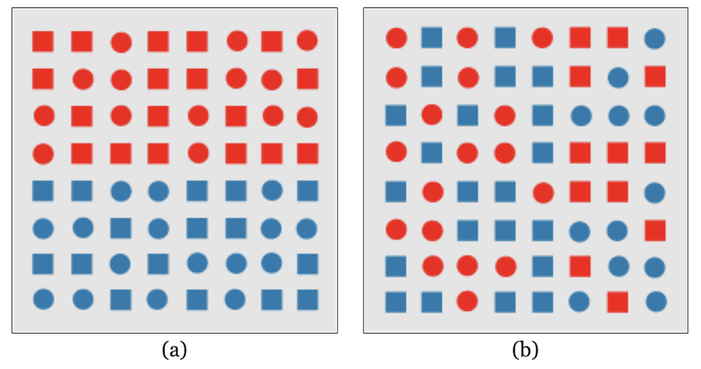]

---
### Mais la perception est aussi rapidement *perturbée* par la complexité

.center[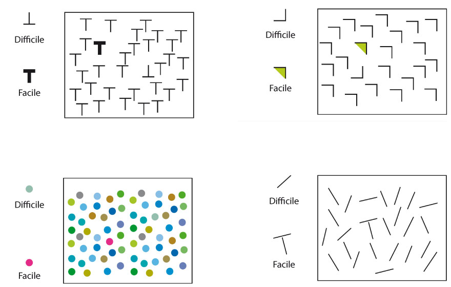]

---
class: middle

**&#8594;** On retrouve des éléments de la **sémiologie graphique**, des variables rétiniennes

- *Cependant, une image cartographique, une planche d'infographie, est un ensemble plus complexe qu'une variation unique de formes simples : c'est une mise en page.*

--

- Concrètement, la lecture d'une image infographique nécessite *plusieurs lectures successives*, avec des **réglages**, des **filtrages** différents de la perception, pour repérer des relations variées entre éléments, selon le type de graphique.

--

- Ces lecture successives peuvent être guidées, encouragées, par une organisation de la page, la **composition graphique**, et par les principes du **storytelling**.

---
**2. La perception post-attentive, la prise en compte de formes multiples, organisées : *la composition graphique*  **

De nombreuses ressources existent pour guider la composition graphique, souvent sous des appellations comme "*principes*", "*règles*", voir "*lois*".

Elles restent subjectives, liées à l'expérience et sont rapidement perturbées par la complexité visuelle.

---
- **Le sens de lecture**

.center[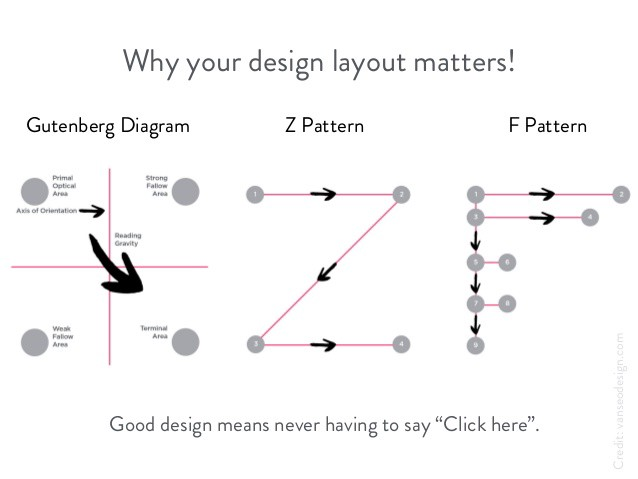]

---
class: middle

.center[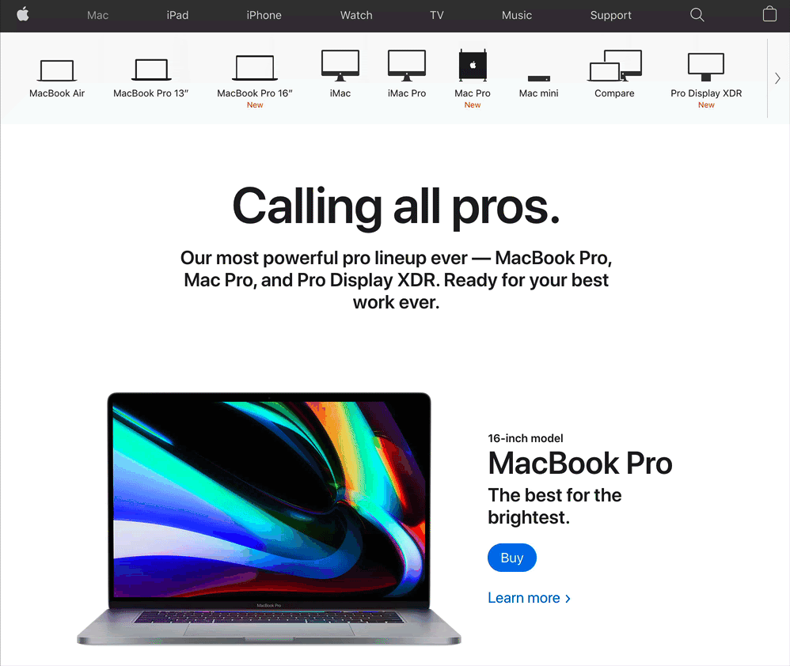]

---
class: middle

.center[]

---
- **La hiérarchie visuelle**

**&#8594;** Le sens de lecture est aussi guidé par le *poids visuel* des éléments graphiques, et leur organisation dans la page.

L'idée est de proposer des *gradients perceptibles* de certaines propriétés pour guider la lecture (ou la perturber rhétoriquement) :

- Taille / échelle relative
- Couleur / Contraste
- Alignement / liaison
- Répétition / rythme
- Proximité / espace vide

---
##Illustration de ces principes
À partir des dessins d'(un tutoriel de Visme)[https://visme.co/blog/visual-hierarchy/]

**Taille / échelle**
.center[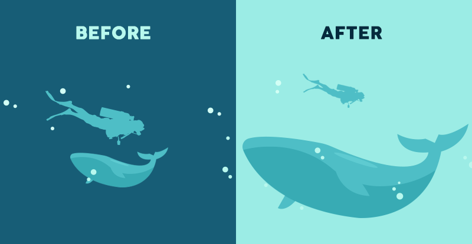]

---
class: middle

**Couleur / contraste**
.center[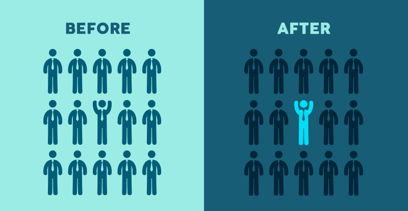]

---
class: middle

**Alignement / Liaison**
.center[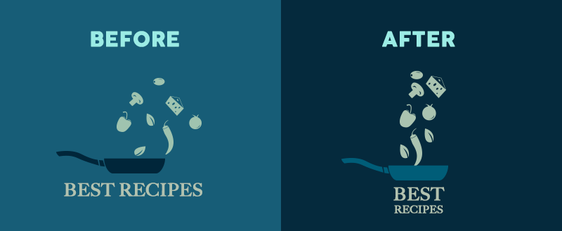]

---
class: middle

**Répétition / rythme**
.center[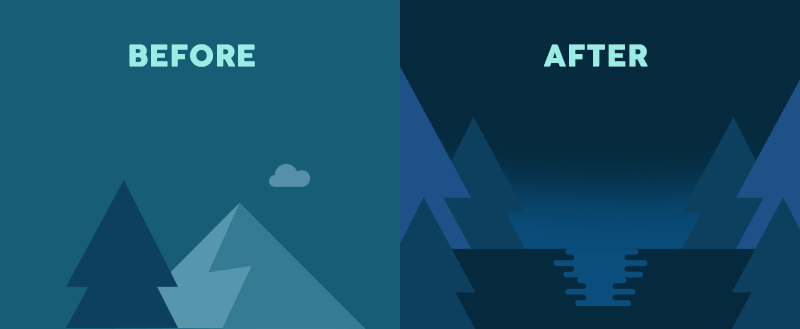]

---
class: middle

**Proximité / espace vide**
.center[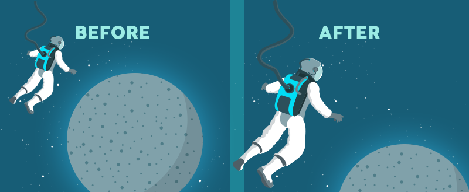]

---

## Certaines caractéristiques graphiques vont aussi avoir des effets esthétiques
- L'équilibre / le déséquilibre - la tension
- Les harmonies colorées
- La capacité d'évocation du contenu
- L'effet de surprise, de découverte

---
**Illustration avec deux posters primés au FIG**

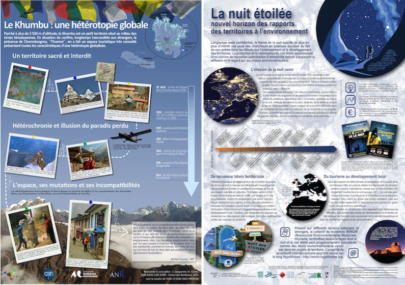

Liens : [Poster Khumbu, UMR Passages](http://mappemonde-archive.mgm.fr/num45/mois/moi15101.html) - [Poster Nuit étoilée, Collectif Renoir](https://renoir.hypotheses.org/1174])

---
class: middle

## Une fois ces principes acquis, existe-t'il des outils pour évaluer la lisibilité d'une image facilement ?

**&#8594;** Oui ! Grâce aux progrès de la simulation de la vision et de l'intelligence articificielle (aidée par le travail de petites mains...)

---

# Comment tester la lisibilité de ses mise en pages?

--

- Le flou

--

- La mesure de la complexité visuelle

--

- L'évaluation de la complexité de lecture :
  - La simulation de systèmes de perception (saillance visuelle)
  - Un modèle d'intelligence artificielle entrainé sur des infographies.
  
---
### Le flou

Longtemps, la seule technique disponible pour évaluer la hiérarchie visuelle d'une image complexe était le flou.

--

Un outil en ligne : [Pine Tools](https://pinetools.com/blur-image).

.center[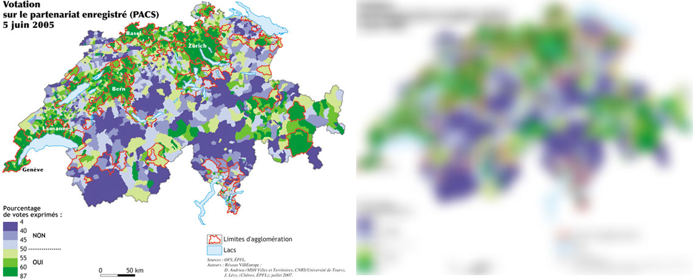]

---
### La mesure de la complexité visuelle

Plusieurs chercheurs ont essayé de mesurer la complexité visuelle, comme indice de la complexité de lecture.

Cependant, cette complexité est multiple :

.center[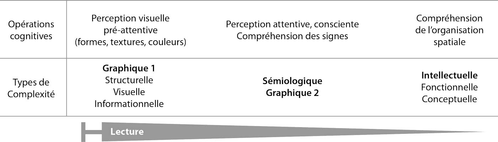]
[Article sur le sujet](https://journals.openedition.org/cybergeo/25271)

---
class: middle

Pour la **complexité graphique**, qui peut être une partie de la complexité visuelle totale, il existe des possibilités de mesure :

- Les quadtrees (subdivisions)

.center[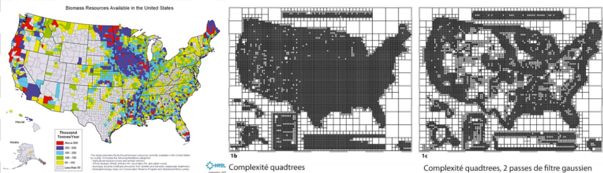]

---
class: middle

- la compressibilité locale (fenêtre glissante, kernel)

.center[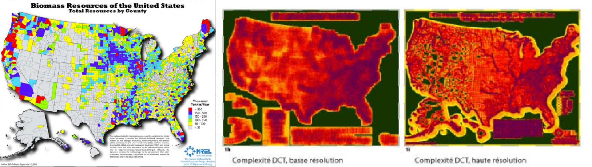]

---
class: middle

###L'évaluation de la complexité de lecture : des tests utilisateurs

Un [article)(https://www.mdpi.com/2220-9964/4/2/418/htm) de 2015 présente une série d'expériences d'évaluation de la complexité de lecture de cartes topographiques par une enquête basée sur des images.

.center[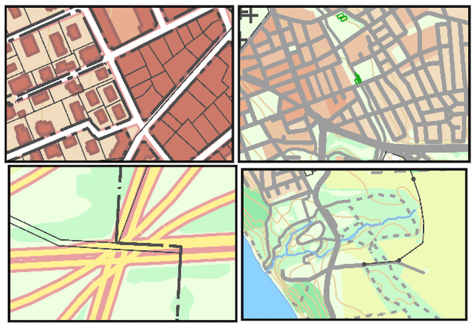]

---
class: middle

Ils aboutissent aux conclusions suivantes :

- c'est la **quantité d'information** qui joue le plus sur la complexité de lecture ressentie, notamment la longueur totale des limites d'objets (nombre + complexité)

--

- ensuite on trouve la **distribution spatiale** de l'information (dispersion)

--

- la *complexité graphique ne joue pas beaucoup* (objets et résolution)

--

Cependant, il s'agit d'une enquête qui comparait des portions de cartes, pas des mises en pages complètes, et uniquement des cartes topographiques.

---
class: middle

Voici les résultats des différentes mesures, notez les coefficients r.

.center[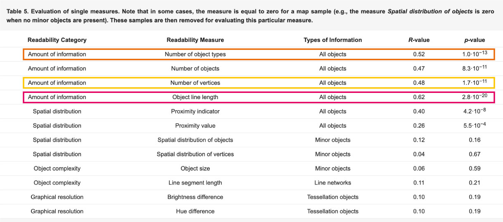]

---
### L'évaluation de la complexité de lecture : La simulation de systèmes de perception

Cette technique a connu de rapides développements depuis les années 1990, avec le besoin de mettre au point des robots autonomes, capables d'interpréter leur environnement visuel (pensez aux voitures autonomes).

--

Des recherches se sont intéressées à la simulation des différents systèmes de la perception visuelle humaine, en aboutissant à des images évaluant les *focalisations oculaires* et la *saillance visuelle* des images.

.center[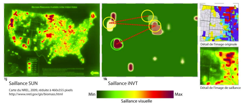]

--

Cependant, ces simulations étaient basées sur des *scènes naturelles*, pas des infographies, et tous les éléments artificiels, dont certaines couleurs, étaient sur-évaluées.

---
### L'évaluation de la complexité de lecture : La simulation par entrainement d'IA

Avec le développement des capacités des réseaux de neurones, ont été mis au point des algorithmes qui peuvent simuler des réactions humaines, en les entraînant sur des milliers de cas d'exemple diversifiés.

--

En 2020 des chercheurs d'Adobe (Photoshop) ont réussi à produire une AI capable d'évaluer la saillance visuelles d'images infographiques.

[Lien vers le site, article + données](http://predimportance.mit.edu/)

--

Ils ont entraîné un réseau de neurones sur un jeu de données de *1000 infographies* (posters, affiches, tableaux de bords de données, pages de sites web...), à partir des réactions de *250 personnes* à qui on a demandé de sélectionner sur ces images les zones les plus importantes.

---
class: middle

Les résultats sont très impressionnants (dernière colonne) :

.center[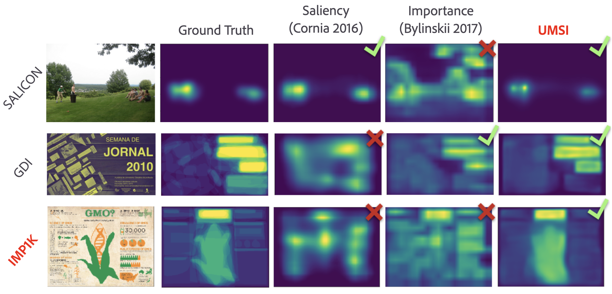]

---
class: middle

Surtout, *le code et les outils pour le faire fonctionner sont disponibles librement* sous la forme d'un bloc-note interactif Python. Ainsi, on peut exécuter en ligne gratuitement via une image Binder déposé sur [**le github #TransCarto**](https://github.com/transcarto/predimportance-public).

> .center[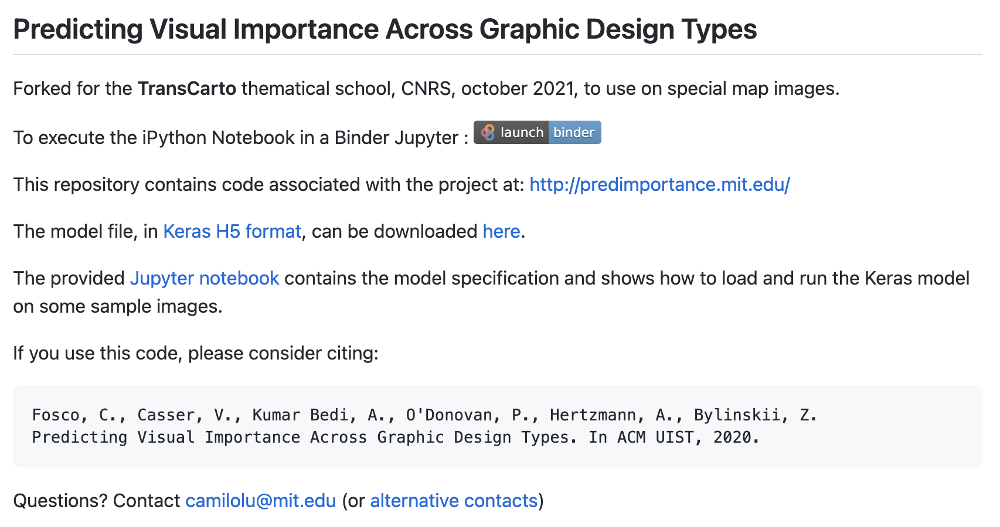]

---
class: middle

## Démonstration

---
class: middle

#Différents besoins de lisibilité des images cartographiques, selon leur fonctionnement

--

- **Quelle adaptation de l'image à la *perception visuelle* humaine ?**

> **&#8594;** Fonctionnement de la perception visuelle des images

--

- **Quelle adaptation de l'image à une bonne expression de son contenu pour sa fonction ?**

> **&#8594;** Conception et *design graphique*

--

- **Quelle *expérience du public* face à ce type d'image ?**

> **&#8594;** État de l'art et études de *réception*

--

- **Quel *accompagnement* du public pour sa compréhension ?**

> **&#8594;** Les lectures comme processus : animation, *storytelling*, interactivité.

---
## L'évaluation de l'*expérience du public* face à ce type d'image ?

C'est la thématique parent pauvre de notre présentation.

--

Elle est traditionnellement issue de l'expérience, mais on peut explorer certains outils comme :

- l'étude de l'état de l'art : que font les autres auteurs pour ce public ?
> Recherches d'images, de références.

--

- les enquêtes : on fait des tests entre différentes présentations.
> Exemple des travaux de l'IGN sur les styles des cartes topographiques [(S. Christophe, Ch. Hoareau, J. Ory)](https://www.lemonde.fr/blog/binaire/2019/12/16/les-cartes-cest-trop-style/)]

--

- les études de réception : on regarde comment sont lues et utilisées des illustrations existantes.
> Peu utilisé en cartogrpahie, mais courant en histoire de l'art.

---

## La lecture d'une image cartographique comme processus, et l'accompagnement du public : *storytelling*, animation et interaction.

Les journalistes et documentaristes, d'abord en format vidéo puis web et papier, savent bien que pour présenter une information complexe il faut la présenter progressivement, si possible en *racontant une histoire* : le **storytelling**.

--

Cette possibilité est offerte par le format web, on la retrouve notamment dans :

- Les articles web utilisant des cartes
> [Les effets de la pandémie sur le trafic aérien, NYT](https://www.nytimes.com/interactive/2020/02/21/business/coronavirus-airline-travel.html)

- Les "*storymaps*"
> [Le voyage d'Arya](https://storymap.knightlab.com/examples/aryas-journey/)

- Les carnets interactifs : Jupyter (R, Python), Observable (D3, JavaScript).
> [L'évolution des habitudes après-Covid19 avec Observable](https://observablehq.com/@bartok32/has-the-pandemic-affected-our-listening-habits?collection=@bartok32/data-driven-stories)

- Les applications en ligne, comme le [*Mobiliscope*](https://mobiliscope.cnrs.fr/fr)
